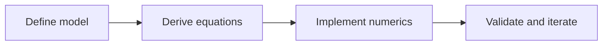

这是新站点的第一篇公开日志，用于约定后续科研记录格式。

## 记录原则

- 问题定义明确：先写清目标和已知条件
- 假设可追溯：标记每个近似和边界条件
- 结果可复现：给出参数、脚本入口和版本

## 公式测试

行内公式：$E = \hbar \omega$。

行间公式：

$$
H = \sum_{ij} t_{ij} c_i^\dagger c_j + \sum_i U_i n_{i\uparrow} n_{i\downarrow}
$$

## Mermaid 测试

