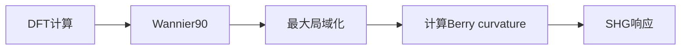

本周完成基于Wannier函数的非线性光学响应计算，成功获得MoS2单层的二次谐波产生（SHG）谱。

## 理论背景

### 二次谐波产生 (SHG)

二阶非线性光学响应由二阶极化率张量 $\chi^{(2)}$ 描述：

$$
P_i^{(2\omega)} = \epsilon_0 \sum_{jk} \chi^{(2)}_{ijk} E_j^{(\omega)} E_k^{(\omega)}
$$

对于二维材料，SHG响应与Berry curvature存在内在联系。

### MoS2电子结构

MoS2单层为直接带隙半导体：
- 带隙 $\approx 1.8$ eV
- K点和K'点处存在谷简并（破缺SOC时）
- SOC导致谷分裂 $\approx 150$ meV

## 计算流程

### 参数设置

- **DFT软件**: VASP
- **Wannier**: Wannier90 v3.1
- **k-grid**: $12 \times 12 \times 1$
- **能带拟合**: 12个Wannier函数（Mo: d轨道, S: p轨道）

## 计算结果

### SHG光谱

峰值位置对应A激子 ($\approx 1.9$ eV) 和B激子 ($\approx 2.0$ eV)

### SHG张量

| 分量 | 值 (pm/V) |
|------|-----------|
| $\chi^{(2)}_{xxx}$ | 3.2 |
| $\chi^{(2)}_{xyy}$ | -1.8 |
| $\chi^{(2)}_{xxy}$ | 2.1 |
| $\chi^{(2)}_{yxx}$ | 2.1 |
| $\chi^{(2)}_{yyy}$ | 0.4 |
| $\chi^{(2)}_{yxy}$ | -1.8 |

### Berry curvature

在K/K'谷处存在显著的Berry curvature峰，与SHG响应一致。

## 结果分析

1. MoS2的SHG响应具有明显的各向异性
2. 激子效应对SHG有重要贡献
3. Berry curvature与SHG的关联验证了理论预测

## 下一步

1. 扩展到TMDC家族：WS2, MoSe2, WSe2
2. 计算三层MoS2的SHG响应
3. 探索应力调控对SHG的影响
